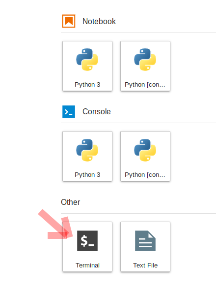

# JupyterHub Connection

## Why are we using a shared cloud environment?

Teaching software to a diverse group of participants, each with different computers and operating systems, can be challenging. As you'll learn in the next lesson, there are specific ways to configure our software for the tutorials to be successful, so it takes time to get everyone set up consistently. Our solution to this is to give everyone access to a cloud computing environment that is pre-configured for the specific software we will deploy. This cloud computing instance can be accessed from any web browser, which eliminates the need for configuring each person's individual computer.

We will encourage you to use our shared resources for all the tutorials, and you can optionally use this for your projects as well. We also hope you will practice installing Python libraries locally on your laptop so that you can continue working after leaving our event (see our next lesson for details).

## How do I access the shared cloud environment?

Access to our shared cloud environment is easy. Just click on [{{ jupyterhub_url }}]({{ jupyterhub_url }}).

Assuming you set up your GitHub credentials correctly (see the previous lesson), you can now click on the "Sign in with GitHub" button. Then, authorize the OAuth app to connect to your GitHub account.

You will be put back to a page that shows a single image choice for your server. Click "Start" to launch your JupyterLab server!

It will take a little bit of time for this to load - be patient! Once things are spun up you will see your very own instance of a [JupyterLab](https://jupyterlab.readthedocs.io/en/stable/) environment:

## What is Pangeo and how is this system configured?

[Pangeo](https://pangeo.io) is a community of researchers building open, reproducible and scalable scientific software tools. Several of us are involved in projects with NASA and NSF to build prototype systems to enable data discovery in the era of expanding data volume and complexity.

For this hackweek, we have created virtual computing instances on Amazon Web Services that can be deployed on demand in a parallel computing environment. We use JupyterHub as a way to give a Jupyter Notebook server to each person in a group. [These slides](https://www.slideshare.net/willingc/jupyterhub-a-thing-explainer-overview?from_action=save) give a nice overview of what JupyterHub is all about. We use JupyterHub in an educational setting because it enables us to quickly begin working with code without spending time to get the necessary libraries and dependencies set up on everyone's individual computers.

### How do I get my code in and out of Pangeo?

When you start your own instance of Pangeo you will have access to your own virtual drive space. No other Pangeo users will be able to see or access your data files. You can easily upload files to your virtual drive space and save files from Pangeo back to another location, such as GitHub or your own local laptop drive.

Here we'll show you how to pull (copy) some files from GitHub into your virtual drive space using git. This will be a common task during the hackweek: at the start of each tutorial we'll ask you to "fork" (create your own copy of in your GitHub account) and "clone" (make a copy of in a computing environment, such as your local computer or Pangeo instance) the GitHub repository corresponding to the specific tutorial being taught into your Pangeo drive space.

To clone (copy) a code repository from GitHub, we will need to interface with the file system of Pangeo. Pangeo is deployed in a Linux operating system and we will need to open a terminal within Pangeo to manage our files. There are two ways to do this: (1) Navigate to the "File" menu, choose "New" and then "Terminal" or (2) click on the "terminal" button in JupyterLab:

This will open a new terminal tab in your JupyterLab interface:

Now you can issue any Linux commands to manage your local file system.

Now let's clone a repository (Note: we'll be teaching about Git clone during our introductory tutorials). This tutorial is built in a repository called "preliminary", so let's try cloning that. First, navigate in a browser on your own computer to the repository link [here](https://github.com/ICESAT-2HackWeek/preliminary). Next, click on the green "clone or download" button and then copy the url into your clipboard by clicking the copy button:

Now navigate back to your command line in JupyterLab. Type "git clone" and then paste in the url:

!!! note "A note about cutting and pasting"
    Pasting something from your clipboard into the Pangeo terminal requires holding down the "shift" key and right-clicking.  This is different from the usual Linux method that only requires a right click.

After issuing the Git clone command you should see something like this:

You may also upload files from your local system using the upload button (up-pointing arrow) on the top left of the JupyterHub navigation panel. Similarly, you may download files to your local system by right-clicking the file and selecting download (down-pointing arrow).

Simple, example GitHub/git/local-workspace workflows for getting a tutorial started in your Pangeo instance and working on a group project are provided. The [getting started on a tutorial](https://icesat-2hackweek.github.io/learning-resources/tutorials/getting_started) workflow briefly reviews much of the information in this preliminary exercise along with steps for making and saving notes or other changes as you work through the tutorial and keeping it updated with the original, master copy. The [basic git workflow for a project](https://icesat-2hackweek.github.io/learning-resources/projects/example_workflow) serves as a reminder of the git workflow for working on a group project while minimizing code conflicts that could result from multiple people making changes to the same files simultaneously.
 
 

## How do I end my Pangeo session? Will I lose all of my work?

When you are finished working for the day it is important to explicitly log out of your Pangeo session. The reason for this is it will save us a bit of money! When you keep a session active it uses up AWS resources and keeps a series of virtual machines deployed.

Stopping the server happens automatically when you log out, so navigate to "File -> Log Out" and just click "Log Out"!

!!! warning "logging out"
    Logging out will **NOT** cause any of your work to be lost or deleted. It simply shuts down some resources. It would be equivalent to turning off your desktop computer at the end of the day.
