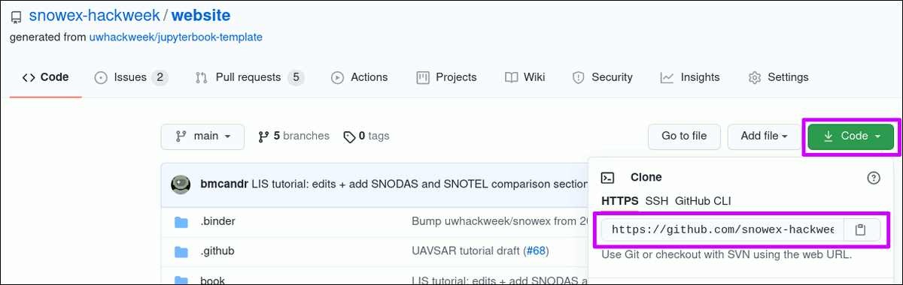
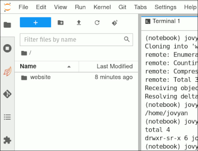
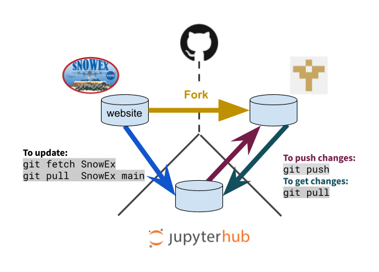
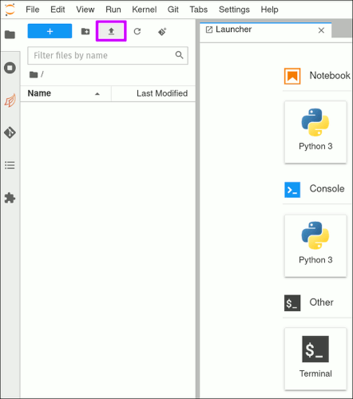

# GitHub, Git, JupyterHub

```{admonition} Learning Objectives
- Use `git` to create copies of hackweek repositories on GitHub for modification
- Navigate the JupyterLab interface for writing and executing code
```

```{important}
Before we go over this tutorial we expect that you have already gone through these preparation materials:
- [JupyterHub login setup](../preliminary/jupyterhub)
- [First time `git` setup](../preliminary/git)
```

## Git review

Here we will do a quick refresher on the different commands you will be using
during this event. A good summary is [this cheatsheet from GitHub](https://training.github.com/downloads/github-git-cheat-sheet.pdf).

These are a few commands we will use throughout the week:
| Git command | What it does |
|---|---|
| `git add` | Adds a new, previously untracked file to version control and marks already tracked files to be committed with the next `commit' |
| `git commit` | Saves the current state of the repository and creates an entry in the log |
| `git log` | Shows the history for the repository |
| `git clone` | Copies a repository to your local environment, including all the history |
| `git pull` | Gets the latest changes of a previously cloned repository |
| `git push` | Pushes your local changes to the remote repository, sharing them with others |

## How do I make notes in the tutorials?

In order to make personal notes in the notebooks for each tutorial that you
can save and keep for later reference, you first need to make a
[fork](https://docs.github.com/en/get-started/quickstart/github-glossary#clone)
of the website. A fork is your personalized copy of the website that will be
stored under your GitHub user account instead of the {{hackweek}} organization account.
This also enables you to write to that repository, which in contrast you can not
do with the {{hackweek}} organization repository. A fork is also a first common step
to contribute to open-source projects and further described in the
[Pro Git book](http://git-scm.com/book/en/v2/GitHub-Contributing-to-a-Project).

To make a fork of the website, go to the {{ '[GitHub repository]({url})'.format(url=website_url) }} and hit the 'Fork' button in the top right corner. In the follow-up dialog, choose your user account as the destination


Next steps are the same as described in the follow section on how to get code
copied to the JupyterHub.

```{note}
Remember that `JupyterHub` refers to the servers hosting our computing environment, and `JupyterLab` is the web-based user interface that we interact with.
```

## How do I get code from GitHub to the JupyterHub?

After you successfully set up the {ref}`git command<setting-up-git>`, you can
copy code between the two using the [clone](https://docs.github.com/en/get-started/quickstart/github-glossary#clone)
command with `git`. A `clone` creates a copy of the repository with the current
state of the repository including the complete history.

### Example: Clone the fork of the website with the tutorials

1. Go to your user page on GitHub and select the 'website' repository.

   The URL to clone the repository can be found after clicking on the green 'Code' button.

   
   <br/><br/>

2. On the JupyterHub, open a new Terminal using the 'Launcher' or via the menu
   File -> New -> Terminal

   By default, a new Terminal will be in your home directory. Use the `pwd`
   command to verify:

   ```shell
      pwd
   ```

   Output:
   ```shell
   /home/jovyan
   ```

3. In the Terminal, issue the `git clone` command and paste the URL you copied
   in step 1.

    ```{admonition} A note about cutting and pasting
    Pasting something from your clipboard into the JupyterLab terminal can require holding
    down the "shift" key and right-clicking.  This is different from the usual Linux
    method that only requires a right click.
    ```

   ```{attention}
      The below sample command has the `<github-username>` as a placeholder.
      This should be replaced with your GitHub username.
      <br/><br/>
      This step will also create a folder in the current location of your
      terminal. The folder will be called `website2022`, which originates from the
      name of the repository.
   ```

   Your command should look similar to this before hitting the Enter key to execute it:
    ```shell
    git clone https://github.com/<github-username>/website2022
    ```

   Sample output:
   ```shell
   Cloning into 'website2022'...
   remote: Enumerating objects: 3295, done.
   remote: Counting objects: 100% (310/310), done.
   remote: Compressing objects: 100% (212/212), done.
   remote: Total 3295 (delta 159), reused 201 (delta 80), pack-reused 2985
   Receiving objects: 100% (3295/3295), 84.81 MiB | 31.23 MiB/s, done.
   Resolving deltas: 100% (1951/1951), done.
   ```

4. You now have a local copy of the website.

   To verify, list the current working directory via the `ls` command:

   ```shell
   (notebook) jovyan@jupyter:~$ ls -l
   ```

   Sample output:
   ```shell
   total 4
   drwxr-sr-x 6 jovyan users 4096 Jul  9 17:10 website2022
   ```

   You will also see the folder on the left-hand side in the file explorer:
   

You are now set up to follow along with all tutorials, including making changes
and then saving those by [recording changes with `git`](http://git-scm.com/book/en/v2/Git-Basics-Recording-Changes-to-the-Repository).

To store your commits to GitHub, don't forget to issue a `git push` from your
repository.

```{admonition} For advanced users: Using a branch for personal changes
While it is not required to create a [branch](https://docs.github.com/en/get-started/quickstart/github-glossary#branch)
for your personal annotations, it is a common practice to do so when making changes
to a repository.

Think of the `main` branch as the tried and tested version of a repository and
a new branch from that is used to introduce a change that can slowly progress.
Once ready, it will be merged to the `main` branch.

The chapter of [contributing to a project](http://git-scm.com/book/en/v2/GitHub-Contributing-to-a-Project)
describes more behind this principle.

Commands for branches:
* To create a branch named _my_work_:
`git branch my_work`
* To change to the branch:
`git checkout my_work`
* To delete a branch:
`git branch -d my_work`
```

## How do I keep up with changes to the initial forked repository?

By making a fork of the website, you are creating a copy of the website as
of the date you clicked the 'Fork' button. This also means that your version will not
get any updates automatically if the website repository is changed after
your fork was created.

To update your forked version with changes from the {{hackweek}} version, you need to
do a one time setup. This process is also called
['working with a remote'](http://git-scm.com/book/en/v2/Git-Basics-Working-with-Remotes)
for a git repository.

### Add the {{hackweek}} organization repository as a remote

A remote is defined with a label and a URL. In our case and command below,
we are using Hackweek as the label and {{ '`{url}.git`'.format(url=website_url) }}
as the URL.

```{Note}
The chosen label Hackweek is found in many projects as the `upstream`. Here we
just went with a more descriptive label instead of the default value.
```

```shell
# Change to the website folder, it was created with the `clone`
cd website
# Add the remote
git remote add Hackweek https://github.com/ICESAT-2HackWeek/website2022.git
```

The command will not return any output. Instead, we verify by printing the
list of known remotes for this repository:

```{attention}
   The below sample output has the `<github-username>` as a placeholder
   and should show your GitHub username.
```

```shell
 git remote -v
 Hackweek	https://github.com/ICESAT-2HackWeek/website2022.git (fetch)
 Hackweek	https://github.com/ICESAT-2HackWeek/website2022.git (push)
 origin	https://github.com/<github-username>/website.git (fetch)
 origin	https://github.com/<github-username>/website.git (push)
```

You are now set up and do not need to repeat this before every update you
fetch from the website.

### Getting the changes from the originally forked repository

To update your fork of the website, you first need to fetch and then pull
the changes. A fetch is a pre-step that reads all the changes that need to
be applied to your fork. The `{{hackweek}}` command options indicates from which
source the changes will be queried from.

Reading changes from the remote '{{hackweek}}':
```shell
git fetch Hackweek
```

To now also get and apply those changes, you need to issue a `pull` command.
In contrast to the above, you also need to specify which branch you want
to get the changes from. In most cases, this will be the 'main' or 'master' branch
of a repository.

```{attention}
It is __highly__ recommend to have no uncommitted changes in your
repository before pulling changes from a remote. To verify this, a `git status`
command should return `nothing to commit, working tree clean` at the end of the
output.
```

Applying changes from the remote '{{hackweek}}':
```shell
git pull Hackweek main
```

```{note}
For more information about branches, see the
[Pro Git book chapter](http://git-scm.com/book/en/v2/Git-Branching-Branches-in-a-Nutshell)
```

Last and to update your fork on GitHub, issue a:
```shell
git push
```

### Overview of a forked and then updated repository



## How can I upload a file to the JupyterHub?

```{attention}
The below description works well for smaller files (<10 MB) or zipped archives.

Your files are persisted acrosss server shutdowns and startups and you don't have
to upload them again when you log out at the end of the day and restart anew the
next day.

The user space has a total limit of 10 GB, which is a {{hackweek}} JupyterHub set limit.
You can use `/tmp` for temporary large files and they **are not** persistet after
logout.

We also have an Amazon S3 bucket for larger files you need for your projects.
Ping us on Slack for details on how to get your files onto there.
```

Uploading a file to your userspace on the JupyterHub can be done using the
user interface in the browser. Below screenshot shows the location of the upload
button (purple highlighted box), which will open a dialog in your browser.



## Summary

Congratulations! That's the end of our "GitHub, Git, JupyterHub" tutorial. You now are equipped with basic `git` commands and have familiarity with the JupyterHub computing environment.

## References

If you want to learn more about these topics, check out the following references:

* [GitHub Official Documentation](https://docs.github.com)
* [JupyterLab Official Documentation](https://jupyterlab.readthedocs.io/en/stable/)
